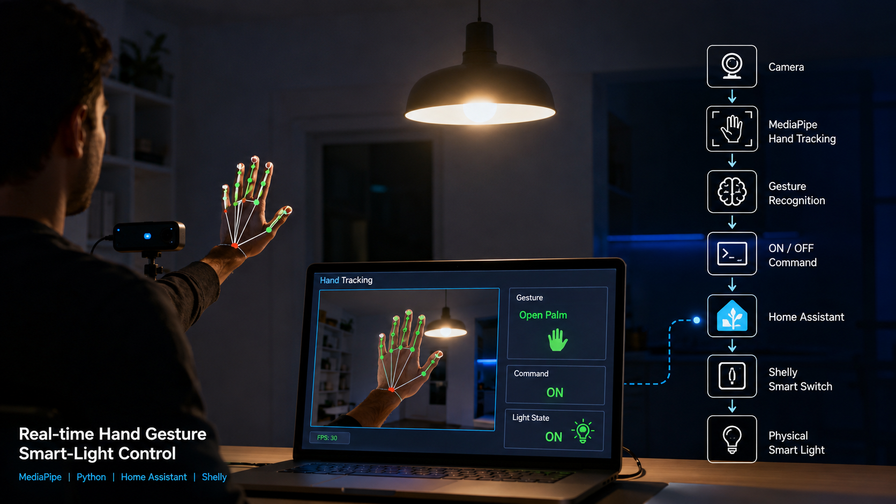
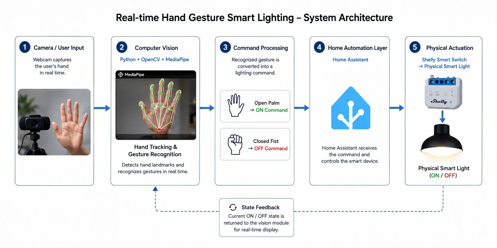

# Real-Time Hand Gesture Control for Smart Lighting



A computer vision-based smart lighting system that allows a user to control a physical light using hand gestures.

The project combines **real-time hand tracking with MediaPipe**, **Home Assistant**, and a **Shelly smart switch** to create a simple Human-Machine Interaction interface for smart-home and building-automation applications.

## Overview

Instead of using a traditional physical switch or a graphical control panel, this project uses a camera to detect the user's hand and recognize predefined gestures.

The detected gesture is converted into an **ON/OFF command**, which is sent to **Home Assistant**. Home Assistant then communicates with the **Shelly smart switch**, allowing the physical light to be controlled.

The camera interface also provides visual feedback about the detected interaction and the current lighting state.

## How It Works

```text
        Camera
           │
           ▼
   MediaPipe Hand Tracking
           │
           ▼
    Gesture Recognition
           │
           ▼
      ON / OFF Command
           │
           ▼
      Home Assistant
           │
           ▼
         Shelly
           │
           ▼
      Physical Light
```

The complete control flow is:

**Hand Gesture → Computer Vision → Command → Home Assistant → Shelly → Physical Light**

## Main Components

### Computer Vision

The camera captures the user's hand in real time.

**MediaPipe** is used to detect and track the hand, allowing the application to interpret the user's hand interaction and map it to a lighting command.

### Home Assistant

Home Assistant acts as the integration layer between the computer-vision application and the physical smart-light system.

The application sends the required command to Home Assistant, which handles the control of the connected device.

### Shelly

The Shelly smart switch provides the connection to the physical lighting system.

This makes it possible to move from a software-based gesture recognition system to an actual physical output.

## Real-Time Interface

While the application is running, the camera interface provides visual feedback during the interaction.

It allows the user to see the hand tracking and the resulting lighting state directly while performing the gesture.

## Technologies

* Python
* OpenCV
* MediaPipe
* Computer Vision
* Home Assistant
* Shelly
* REST API
* Smart Home / IoT

## Demo

A complete demonstration of the project is available on YouTube.

▶️ **[Watch the project demonstration on YouTube](https://www.youtube.com/watch?v=qdAkY2eS1vQ&t=19s)**

The demonstration shows the real-time gesture interaction and the resulting control of the physical smart light.

## Why I Built This

I built this project to explore the intersection between **Computer Vision, Human-Machine Interaction, and Smart Building Automation**.

The main idea was to take a simple computer-vision input — a hand gesture — and connect it to a real physical device.

This project demonstrates how different layers can work together:

**Human Interaction → Computer Vision → Software Control → IoT Integration → Physical Actuation**

It also serves as a small example of how alternative user interfaces can be integrated into smart environments.

## Project Architecture



The architecture separates the system into three main layers:

**Input Layer**
Camera and hand interaction.

**Processing & Control Layer**
MediaPipe gesture recognition and Home Assistant integration.

**Physical Layer**
Shelly smart switch and physical lighting.

This separation makes the system easier to understand and provides a foundation for extending the project to additional devices and automation scenarios.

## Future Improvements

Possible extensions include:

* Supporting additional gestures
* Controlling multiple lights
* Adding dimming control
* Controlling other smart-building devices
* Improving gesture recognition robustness
* Integrating the system with a larger Smart Room / BMS environment

## Project Context

This project is part of my broader exploration of:

**Smart Buildings · Building Automation · IoT · Computer Vision · Human-Machine Interaction**

---


**Author:** Abdelkhalek Mammeri
